# 🚧 RecruiTrack Lite 簡易要件定義 & 簡易設計書

- このドキュメントは、RecruiTrack Lite（転職ToDo管理プロトタイプ）の設計を簡単にまとめたものです。  
- バックエンドには Hono＋Drizzle、フロントエンドには Next.js を用いたモノレポ構成を前提とし、DDD＋クリーンアーキテクチャの考え方を取り入れたレイヤー分割を行っています。
- UI やインフラ構成、API 仕様、データベース設計などを網羅します。

---

## 1. 仕様・目的

### 1.1 プロダクト概要
- **RecruiTrack Lite** は、転職活動中に必要なタスク（ToDo）を一元管理し、自分の行動を可視化するミニマムプロトタイプです。
- 機能は「ToDo の CRUD（作成・取得・更新・削除）」に限定します。

### 1.2 目的
- **タスク可視化**：転職に必要な準備や企業調査、面接準備などを把握・管理する。
- **シンプル設計**：最小限の機能に絞ることで、短期間で動作確認が完了する迅速な開発を実現。
- **技術アピール**：DDD＋クリーンアーキテクチャを取り入れたレイヤー分割、モノレポ構成、Docker／EC2を活用したインフラ対応を通じて、技術的な実行力を証明する。
- **拡張性**：将来的に「面談ログ管理」「企業ステータス管理」「書類アップロード」など複雑化しても対応できる設計基盤を構築する。

### 1.3 想定ユースケース
- **ToDo の追加**（タスク名を入力し、ToDo を新規作成する）
- **ToDo の一覧取得**（作成日時順にソートした ToDo リストを表示）
- **ToDo の編集**（タイトル変更、完了フラグの切り替え）
- **ToDo の削除**（指定した ToDo を削除）

---

## 2. 全体アーキテクチャ

### 2.1 モノレポ構成とフォルダ構造

```text
recrui-track/                
├── apps/
│   ├── frontend/              ← Next.js 側
│   │   ├── pages/
│   │   ├── lib/
│   │   ├── types/
│   │   ├── package.json
│   │   └── tsconfig.json
│   │
│   └── backend/               ← Hono + Drizzle 側
│       ├── src/
│       │   ├── domain/
│       │   ├── application/
│       │   ├── infrastructure/
│       │   ├── interface/
│       │   └── shared/
│       ├── drizzle.config.ts
│       ├── package.json
│       └── tsconfig.json
│
├── docker/
│   └── nginx/
│
├── docker-compose.yml
├── .env
├── lite.md                   
└── .github/
    └── workflows/
        └── deploy.yml


```

- フロントエンド（`apps/frontend`）とバックエンド（`apps/backend`）が **並列** に存在し、Docker Compose で一括起動します。
- バックエンドは **DDD＋クリーンアーキテクチャ** のレイヤー分割を行い、それぞれの責務が明確化されます。

```mermaid
flowchart TB
  subgraph EC2["AWS EC2 (Docker Compose)"]
    direction TB

    subgraph NGINX["Nginx リバースプロキシ"]
      direction LR
      API["/api/* → Backend:8787"] 
      WEB["/* → Frontend:3000"]
    end

    subgraph COMPOSE["Docker Compose"]
      direction TB
      Front["Frontend (Next.js)  Port:3000"]
      Back["Backend (Hono)      Port:8787"]
    end

    DB["SQLite (local.db)  or Supabase/Postgres"]
  end

```



---
## ドメイン層設計
- Todo エンティティ
  - 一意識別子（id: string）
  - タイトル（title: string）…空文字禁止、最大100文字
  - 完了フラグ（completed: boolean）
  - 作成日時（createdAt: Date）
  - 更新日時（updatedAt: Date）
  

- entity/Todo.ts（エンティティ）
  - ビジネスルール：
    - タイトルは Title.create() によってトリム済み・空文字禁止・文字数制限を担保。
    - complete() メソッドで「重複完了禁止」や更新日時の更新を行う。
    - changeTitle() メソッドで「タイトル変更時のバリデーションおよび更新日時更新」を行う。
  

- value-object/Title.ts（値オブジェクト）
  - 値オブジェクトの役割：
    - 文字列としてのタイトルに「不変性」「バリデーション」を付与。
    - 直接文字列を扱うのではなく、Title.create() を介してインスタンス化することで、空文字や長すぎる文字列を防止。
  

- repository/ITodoRepository.ts（リポジトリインターフェース）
  - ドメイン層が依存する「永続化処理」の抽象を定義。
  - どのようにデータベースアクセスを行うかは、インフラ実装（DrizzleTodoRepository）に委譲される。


---
## アプリケーション層設計

-  DTO（データ転送オブジェクト）
- CreateTodoInput.ts
- UpdateTodoInput.ts
- TodoOutput.ts
  - 役割：
    - 入力 DTO：ユーザーから受け取った JSON リクエストをこの型で受け取り、ユースケースに渡す。
    - 出力 DTO：ユースケースが返すドメインエンティティを、この型にマッピングしてコントローラ経由でクライアントへ返す。
  

- ポート（インターフェース）（TodoRepositoryPort.ts）
  - ドメイン層の ITodoRepository と同内容を定義。
  - ※重複が気になりはじめたら、domain/repository/ITodoRepository.ts をそのまま再利用。
  

- ユースケース（usecase/）
**GetAllTodosUseCase.ts**
- 役割：
  - リポジトリから全 ToDo を取得し、エンティティ配列を出力 DTO 配列に変換して返却

**GetTodoByIdUseCase.ts**
- 役割：
  - 指定された ID の ToDo を取得し、存在しなければエラー、存在すれば出力 DTO に変換して返却

**CreateTodoUseCase.ts**
- 役割：
  - 新しい ID を生成し、ドメインエンティティを作成 → リポジトリに保存 → { id } を返却

**UpdateTodoUseCase.ts**
- 役割：
  - 既存 ToDo を取得し、タイトル変更や完了処理を行って更新 → リポジトリに保存 → { id } を返却


**DeleteTodoUseCase.ts**
- 役割
  - 指定 ID の ToDo が存在するかチェックし、存在すれば削除。存在しなければエラーを投げる。

---
## インフラ層設計

- db/schema.ts
- テーブル構造：
  - id：文字列プライマリキー（UUID）
  - title：テキスト（NOT NULL）
  - completed：整数（0/1 で boolean 相当）
  - createdAt／updatedAt：タイムスタンプ自動生成

- db/db.ts
  - ローカル DB：local.db に対して Drizzle を初期化し、スキーマをバインド
  - 将来的に Supabase/Postgres へ移行する場合は new Database(process.env.DATABASE_URL) などに変更可能。

- repository/DrizzleTodoRepository.ts
- 役割：
  - エンティティから取得／永続化のための CRUD 操作を正しく実装。
  - findAll → レコードをすべて取得し、ドメインエンティティに変換。
  - findById → 指定 ID のレコードを取得し、存在しなければ null。
  - save → 既存レコードがあれば更新、なければ新規作成。
  - deleteById → 指定 ID を削除。

---
## インターフェース層設計

- controller/TodoController.ts
- 役割：
  - HTTP リクエストのパラメータ／ボディを取り出し、適切なユースケースに変換して実行
  - 成功時・例外発生時に応じたステータスコードを返却
  - ドメイン層やユースケース層のロジックは一切持たず、エラーをキャッチしてクライアントへ適切なメッセージを返す

- router/index.ts
- 役割：
  - Hono アプリケーションを初期化し、エンドポイントとコントローラメソッドを紐付ける
  - ここではビジネスロジックは一切扱わず、HTTP ルーティングのみ担当

- エントリポイント（src/index.ts）
- 役割：
  - Hono アプリケーションを指定ポートで起動。
  - 環境変数によるポート切替をサポート。

## 共有ライブラリ

- errors.ts
- 役割：
  - 各層で投げる共通エラーをここで定義し、コントローラで instanceof によるハンドリングを行う。


## API 仕様

| メソッド   | パス               | 説明         | リクエストボディ                                   | レスポンス例                                                |
| ------ | ---------------- | ---------- | ------------------------------------------ | ----------------------------------------------------- |
| GET    | `/api/todos`     | ToDo 一覧取得  | なし                                         | `[{ id, title, completed, createdAt, updatedAt }, …]` |
| GET    | `/api/todos/:id` | 指定 ToDo 取得 | なし                                         | `{ id, title, completed, createdAt, updatedAt }`      |
| POST   | `/api/todos`     | ToDo 作成    | `{ "title": "文字列" }`                       | `{ id: "生成されたUUID" }`                                 |
| PUT    | `/api/todos/:id` | ToDo 更新    | `{ "title": "文字列", "completed": boolean }` | `{ id: "更新されたID" }`                                   |
| DELETE | `/api/todos/:id` | ToDo 削除    | なし                                         | `{ message: "deleted" }`                              |


- ステータスコード：
  - 200 OK：取得成功、更新成功、削除成功
  - 201 Created：新規作成成功
  - 400 Bad Request：バリデーションエラー
  - 404 Not Found：指定 ToDo が存在しない、など
  - 500 Internal Server Error：サーバ内部エラー


## データベース設計

- テーブル名：todos
- カラム：
  - id：文字列プライマリキー（UUID 生成）
  - title：テキスト、空文字禁止
  - completed：整数（0/1）
  - created_at／updated_at：タイムスタンプ自動設定

- Drizzle マイグレーション
```bash

npx drizzle-kit diff       # 変更差分を生成

npx drizzle-kit push       # SQLite (local.db) にマイグレーションを適用


# Supabase/Postgres の場合は
# drizzle.config.ts を変更して driver: 'pg', url: process.env.DATABASE_URL へ切り替え
npx drizzle-kit diff       # 差分生成（Postgres 対応）

npx drizzle-kit push       # Supabase/Postgres に適用
```

## フロントエンド設計

- 共通型定義（todo.ts）
- API 通信モジュール（lib/api.ts）
- メインページ (pages/index.tsx)
- 役割：
  - API モジュールを呼び出して ToDo を取得・作成・更新・削除。
  - シンプルなフォームとリスト表示でユーザーが操作できる UI を構築。
  - Tailwind CSSで適切なレイアウトを実装

## シーケンス図

```mermaid

sequenceDiagram
participant U as ユーザー(ブラウザ)
    participant F as Frontend (Next.js)
    participant H as Hono (APIサーバ)
    participant D as Drizzle/SQLite (DB)

    U->>F: フォームでタイトル入力 & 送信
    F->>H: POST /api/todos { title }
    Note right of H: TodoController.create()\n→ CreateTodoUseCase.execute()
    H->>D: INSERT INTO todos (...)
                                                         D-->>H: INSERT 成功
  H-->>F: 201 Created { id }
    H-->>U: 成功レスポンス -> 一覧取得

    U->>F: GET /api/todos
  F->>H: GET /api/todos
  Note right of H: TodoController.getAll()\n→ GetAllTodosUseCase.execute()
    H->>D: SELECT * FROM todos ORDER BY createdAt DESC
  D-->>H: [{…}, {…}, …]
    H-->>F: 200 OK [全 ToDo リスト]
    H-->>U: 取得結果表示



```


## Docker・インフラ構成
- Dockerfile（frontend）
  - ビルド：yarn build で Next.js を本番ビルドし、yarn start でサーバ起動。
  - ポート：3000 番。

-  Dockerfile（backend）
  - ビルド：yarn build によって src/ の TypeScript を dist/ にコンパイルし、node dist/index.js で起動。
  - ポート：8787 番。

- docker-compose.yml
  - frontend：Next.js 本番ビルドをビルド・起動。
  - backend：コンパイル済み Node.js サーバを起動し、SQLite ファイルをボリュームとしてマウント。
  - nginx：リバースプロキシとして、/api/ をバックエンド、その他をフロントエンドにルーティング。

-  Nginx 設定（docker/nginx/default.conf）
  - /api/ → backend:8787
  - それ以外 → frontend:3000

- CI/CD 設計（GitHub Actions）
  - .github/workflows/deploy.yml
  - Secrets： 
    - EC2_SSH_PRIVATE_KEY：EC2 への SSH 秘密鍵 
    - EC2_HOST：EC2 のグローバル IP アドレス
  - 動作： 
    - main ブランチへの Push をトリガーに、リポジトリを EC2 に同期 → Docker Compose をリビルドして再起動。

## EC2 デプロイ手順
```bash
# 1. リポジトリを EC2 へ転送
scp -r ./recrui-track ec2-user@<EC2-IP>:/home/ec2-user/

# 2. EC2 に SSH 接続
ssh ec2-user@<EC2-IP>

# 3. .env を EC2 上で作成／配置
#    （Supabase 環境変数や必要な設定を記載）

# 4. Docker Compose 起動
cd /home/ec2-user/recrui-track
docker-compose down
docker-compose up -d --build

```

